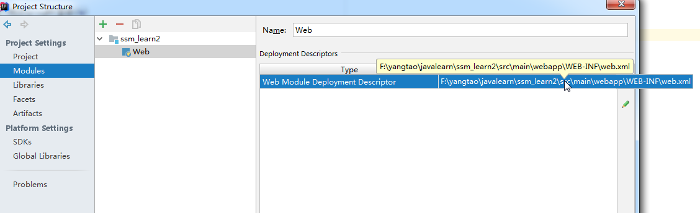
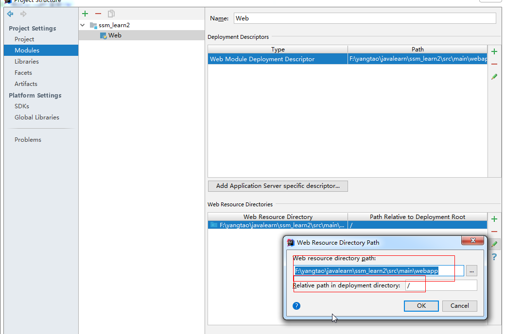

## intellij idea搭建SSM框架(maven+spring+spring MVC+mybatis+mysql)

参考链接：  
https://blog.csdn.net/qq_44543508/article/details/100192558

## intellij idea配置项目架构 module
1. 配置web.xml，为入口配置文件

  

 
2. 将静态资源文件配置到跟目录下

  

 
这样，可以直接通过访问跟路径+index.jsp来测试是否配置ok

3. facets，artifacts都依赖module
4. tomcat依赖artifacts。